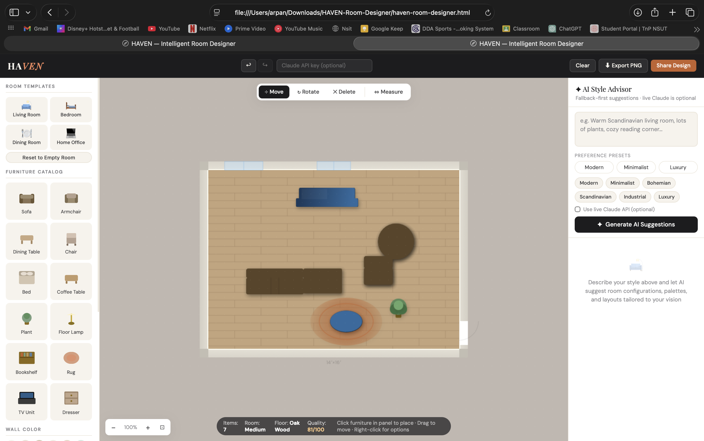
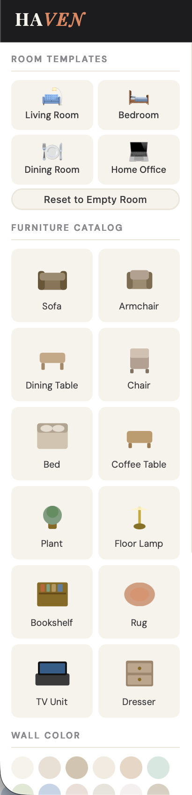
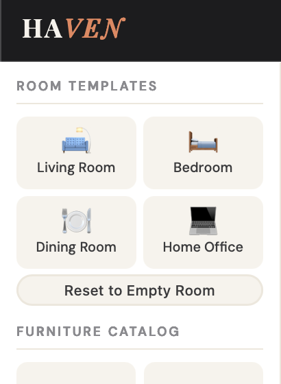
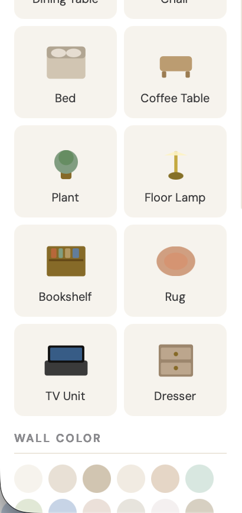
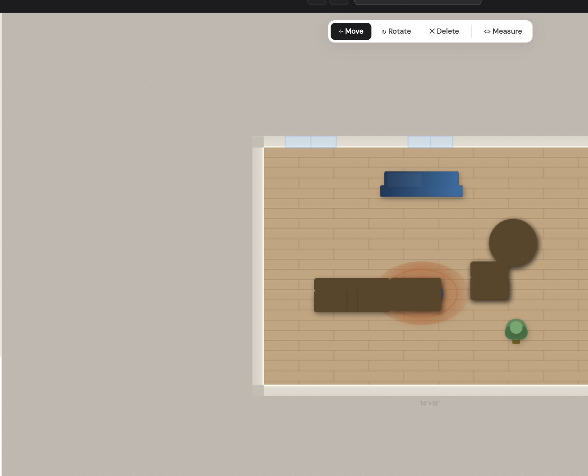
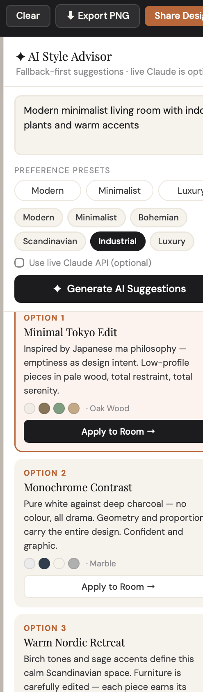
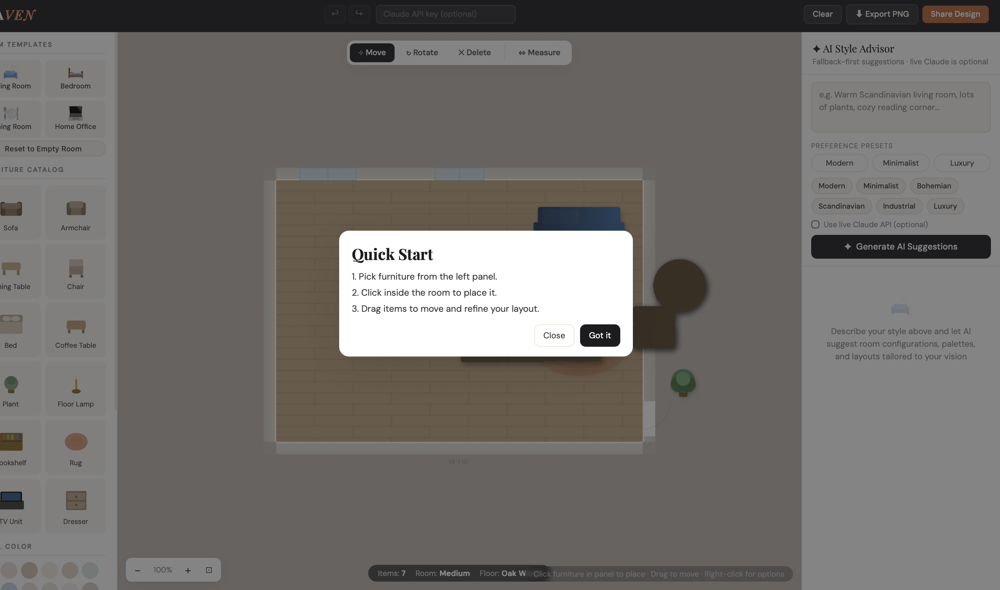

# HAVEN - Intelligent Room Designer
Metadome Solutions Engineer Evaluation Submission

HAVEN is a web prototype for the **Home Decor** track of the assignment.  
It lets users design a room interactively and get AI-based design suggestions that can be previewed before applying.

## What I Built
- Interactive room canvas with furniture placement and manipulation
- Real-time room styling controls (wall color, floor, room size)
- AI style advisor with 5 generated suggestions per request
- Preview-first AI flow (Accept/Cancel before applying changes)
- Export/share utilities for quick demo output

## Main Features
### Room Interaction
- Place furniture from a catalog
- Drag to move, rotate, duplicate, and delete items
- Snap-to-grid toggle
- Undo/redo support
- Right-click context menu and measurement tool
- Smart placement checks to avoid overlap and keep walkway clearance

### Visual Design Controls
- Template-based starting layouts
- Reset to empty room
- Preset and custom wall colors
- Multiple floor materials
- Live quality score for layout feedback

### Generative AI Integration
- Prompt-based style suggestions
- Preference presets (Modern, Minimalist, Luxury)
- Fallback suggestions work without API key
- Optional live Claude API mode
- Every suggestion includes rationale (`Why`, `Best For`, `Mood`)
- Always returns/normalizes to exactly 5 suggestion cards

## Tech Stack
- Single-page app in `haven-room-designer.html`
- Vanilla JavaScript
- HTML/CSS
- Canvas 2D API

## How To Run
1. Open `haven-room-designer.html` in a modern browser.
2. Start designing directly. No install/build step is required.
3. For live AI calls, optionally provide a Claude API key in the header and enable the live API toggle.

## Assignment Coverage
### Game Mechanics
- Implemented core user actions for placement and editing
- Added real-time interaction feedback and placement validation

### Graphics
- Built a focused single-room environment with clean controls and consistent visual styling

### Generative AI
- Added prompt-driven suggestion generation and an application preview flow

### Documentation
- Setup, feature scope, and usage instructions are included in this README

### Creativity
- Added design rationale cards, quality scoring, share/export flow, and first-time user helper overlay

## Demo Screenshots
### 1) Full Prototype Overview

### 2) Left Panel Controls

### 3) Template + Reset Controls

### 4) Color and Floor Controls

### 5) Canvas Workspace

### 6) Top Toolbar and Actions

### 7) AI Suggestion Panel

### 8) First-Time Helper Overlay

## Notes
- This is a **web prototype**, not a Unity/Unreal compiled build.
- The focus was to deliver a complete, testable interaction flow within the evaluation timeline.

## Author
Arpan
